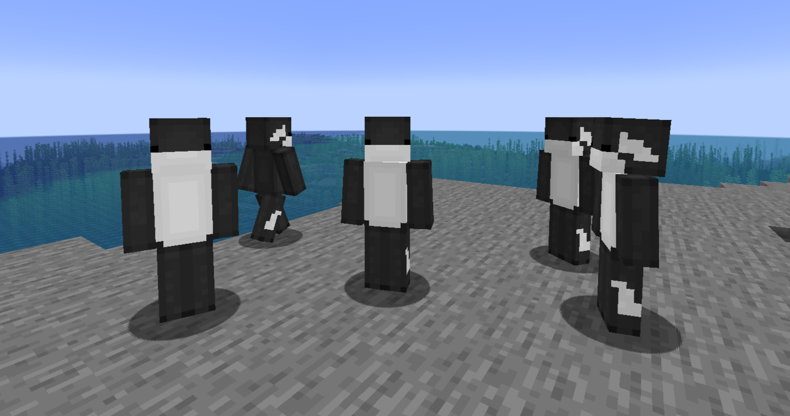
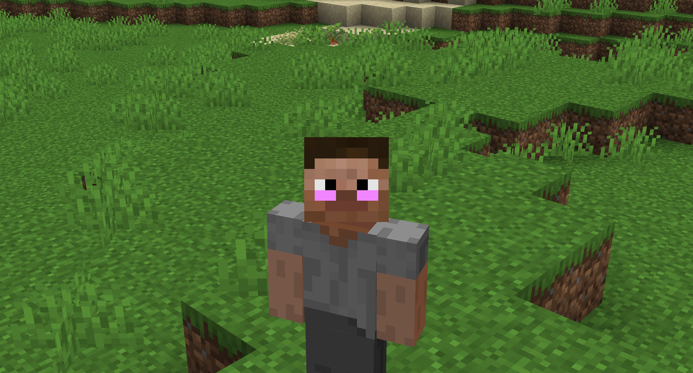

# Cursed Age

**Cursed Age** is a custom Jujutsu Kaisen-inspired Minecraft mod, purpose-built to power the **[Cursed Age](https://cursedage.net)** server — adding new Cursed Techniques, progression systems, and factions on top of the **[Sorcery Age](https://www.curseforge.com/minecraft/mc-mods/sorcery-age)** mod.
Pick a clan, roll your fate, awaken your technique, and carve out a place for yourself as a sorcerer, a curse, or the leader of your own faction.

---

## Table of Contents

- [Getting Started](#getting-started)
- [Cursed Techniques](#cursed-techniques)
- [Special Grade Imbuing](#special-grade-imbuing)
- [Grading Up](#grading-up)
- [Custom Traits](#custom-traits)
- [Factions](#factions)
- [Items & Gear](#items--gear)
- [Effects](#effects)
- [Tweaks](#tweaks)
- [Commands Cheat Sheet](#commands-cheat-sheet)

---

## Getting Started

When you first join, you'll be rolled into one of the server's clans, each with its own odds for which Cursed Technique and traits you start with, plus a Cursed Energy tier that decides how strong your base power is out of the gate:

| Clan | What you might get |
|---|---|
| **Gojo Clan** | Mostly Limitless, occasionally Mimicry. Small chance at Six Eyes (only one can exist on the server at a time) or a boosted RCT. |
| **Zenin Clan** | Ten Shadows or Projection Sorcery. Chance at Heavenly Restriction or the rare Vessel trait. |
| **Ominous Pyre** | Shrine or Techniqueless. Chance at boosted RCT, Vessel, or the coveted Indomitable Soul trait. |
| **Inumaki Clan** | Cursed Speech lineage. |
| **Sukuna's Lineage** | Sukuna's blood runs through you. |
| **Tamashii Clan** | A soul-focused bloodline. |
| **Unaffiliated** | No clan ties — a blank slate. |

Your starting Cursed Energy is also rolled: most players land **Moderate**, some get **Lesser** or **Greater**, and a rare few roll **Immense** — which comes with its own perks (see [Grading Up](#grading-up)).

---

## Cursed Techniques

On top of the base techniques you know from Sorcery Age, Cursed Age adds several brand-new ones:

### 🌀 Antigravity System
Bend gravity itself.
- **Reversal: Field** — Crush everything around you in a field of reversed gravity: enemies get slowed, knocked around, and chipped away with damage over time.
- **Lapse: Body** — Launch yourself forward and up, ignoring fall damage while you're moving.

### 💊 Pain Killer
A support technique built around cleansing and stabilizing.
- **Stabilize (Self)** — Draw a glowing star across your own chest to purge every negative effect on you.
- **Stabilize (Target)** — Do the same for an ally at range.

### 🍬 Sugar Manipulation
Turn your own body into a candy factory.
- **Sugar Extract** — Slowly convert your hunger into sugar (or, with the right food mods installed, marshmallow sticks and candy instead).
- **Sugar Infusion** — Inject cursed sugar into a nearby ally, giving them a burst of Speed at the cost of some of your own hunger.

### 👥 Cloning
Never fight alone again.
- **Clone** — Summon a clone of yourself (up to 4 at a time).
- **Mass Clone** — Summon several clones at once, spread out around you.
- **Body Swap** — Instantly swap places with one of your clones.
- **Cycle Mode** — Switch what your clones are set to do (follow, guard, attack).
- **Clone Manager** — Pull up a menu showing all your active clones and their status.
- **Desummon Clones** — Recall every clone you've got, for free.

### ✨ Miracles
A rare technique built entirely around luck and second chances. Miracle-holders passively build up **Miracle charges** — for example, just being near a newborn baby animal can grant one — and when you're about to take a hit that would otherwise kill you, a Miracle is automatically spent to pull you back from the brink instead.

### 🔥 Disaster Flames (addition)
- **Scorching Hand** — Coat your hand in cursed flame: your attacks burn enemies over time, and you can even use it to cook food like a portable furnace.

---

## Special Grade Imbuing

Certain techniques can be poured into a weapon to forge a true **Special Grade Cursed Tool**. Each path has its own ritual:

- **Angel — Technique Extinguishment:** Cast *Jacob's Ladder* enough times to finish the imbuing.
- **Disaster Flames:** Land enough fire-based ability casts to imbue the weapon with a burning damage-over-time effect.
- **Ratio:** Land enough hits with the Ratio technique to complete the process.

Your progress is tracked right on the item — check the tooltip to see how close you are, and once it's done, the weapon permanently shows off its Special Grade status.

---

## Grading Up

Grinding your way up the ranks isn't a straight line for everyone:

- Everyone can freely grind their way to **Grade 1**.
- **Limitless** users need to possess the **Six Eyes** before they can climb any higher.
- Roll an **Immense** Cursed Energy tier at creation, and you're automatically on track for **Special Grade**.
- Curses running **Disaster Flames**, **Disaster Plants**, **Disaster Tides**, **Idle Transfiguration**, or **Projection Sorcery** have no grade cap.
- **Cursed Spirit Manipulation** users and anyone with the **Perfect Body** trait are also uncapped.
- As a Ten Shadows user, tame **Mahoraga**, and you'll qualify for Special Grade too.

---

## Custom Traits

Traits unique to Cursed Age that you won't find in base Sorcery Age:

- **Indomitable Soul** — A rare trait that automatically grants you the Vessel trait and completely overrides your Cursed Energy nature.

---

## Factions

Band together with other players and build something bigger than yourself. Factions come in three flavors — **Sorcerer**, **Curse User**, and **Curse** — and curses can only found Curse factions (sorcerers can't).

Open the faction menu anytime with `/factions`, or use the full `/faction` command tree to:

- Create, disband, or leave a faction (must be Grade 1+ to found one)
- Invite, kick, promote, demote, or transfer leadership to other members
- Rename your faction, write a description, pick a faction color, and post a notice for members to see
- Set (or clear) a home base
- Browse all factions on the server, check out a faction's info and member list, or view their history

Everything updates live in the GUI — no need to keep re-running commands to see the latest info.

---

## Items & Gear

**Orbs** — powerful, limited-use consumables:
- **Re Orb** — A rare re-roll orb, good for two uses before it's spent.
- **Sorcerer Orb** / **Curse Orb** — Flip your allegiance between Sorcerer and Curse.

**Cursed materials** — Cursed Energy Orbs and Shards, Blocks of Cursed Energy, Curse Orbs, Curse Cores, and Human Remnants for crafting and trading.

**Study tools:**
- **Jujutsu Textbook** — Take a quiz for a shot at bonus sorcerer XP (has a cooldown between attempts).
- **Tattered Jujutsu Textbook** — A one-time use item for a big flat chunk of XP.
- **Textbook Page** / **Writing Paper** — Craft your way toward your own textbooks.

**Throat Medicine** — Soothes your voice: grants Regeneration and cuts your remaining Cursed Speech cooldowns in half.

**Death Painting Blood Bottle** — Blood extracted from a Death Painting. Splash it, throw a lingering cloud of it, or tip your arrows with it to infect enemies with the Mixed Blood effect (see [Effects](#effects)).

**Blocks:**

- **Block of Cursed Energy** — A dense, stackable form of raw cursed energy.

---

## Effects

- **Mixed Blood** — Death Painting blood doesn't mix well with a normal body. Left untreated, it'll steadily drain your health — unless you carry the Death Painting trait yourself.

---

## Tweaks

Smaller changes to base mechanics that affect everyone:

- Going down while regenerating with RCT will bring you back up instead of finishing you off.
- Healing from food scales with your max health, and higher-graded sorcerers get hungry more slowly.

---

## Commands Cheat Sheet

| Command | What it does |
|---|---|
| `/rollscreen` | Open the character creation roll screen |
| `/faction ...` | Manage your faction (see [Factions](#factions)) |
| `/factions` | Open the faction GUI |
| `/miracles check` | Check your current Miracle count |
| `/ceamount check` | Check your rolled Cursed Energy tier |
| `/reorbuses` | Check how many Re Orb uses you have left |
| `/resetjujutsutextbook` | Reset your textbook quiz cooldown |

---

Got questions, found a bug, or have an idea for a new technique? Reach out on the [server](https://discord.gg/3udqmntE53) — Cursed Age is always evolving.
